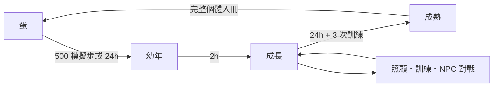

# 口袋怪獸日記

直式像素怪獸養成遊戲。下一版規格讓自然時間完成孵化與進化；玩家選擇連結 iOS 活動資料後，手機步數和 Apple 健康的運動紀錄可加速成長。目前可執行的 Stage A 尚未實作這項改版。主要實機目標為 iPhone 17 Pro，支援目標為 **iPhone 12 及之後機型、iOS 16+**；使用 Xcode 26 系列的 SDK 建置。這是支援與驗收目標，尚未代表所有機型已實測。

**引擎固定：Godot 4.7 stable**，本機驗證版本 `4.7.stable.official.5b4e0cb0f`。遊戲採 GDScript、Compatibility renderer、離線本機存檔，不依賴 Xogot 訂閱。發佈工作流見 [iOS CI/CD](docs/IOS-CICD.md)。

[設計摘要與數值表](docs/GAME.md) · [放置成長與活動加速](docs/IDLE-GROWTH.md) · [iOS 執行架構](docs/IOS-ARCHITECTURE.md) · [驗收紀錄](docs/VALIDATION.md)

已通過本機 iPhone 17 Pro／iPhone 12 模擬器的 Release 建置、安裝與啟動。原生畫面：[iPhone 17 Pro](docs/evidence/09-ios-iphone17-pro.png)、[iPhone 12](docs/evidence/10-ios-iphone12.png)。

## 開始玩

用 Godot 匯入此資料夾的 `project.godot`，按 F6／F5 執行主場景，或在 repository root 執行：

```sh
/Applications/Godot.app/Contents/MacOS/Godot --path prototypes/pixel-monster
```

目前 Stage A 開發版的快速完整循環：

1. **散步 → +1,000 步**：使用明確標示的模擬來源，孵化新手蛋。
2. **食物 → 營養正餐**，再到 **訓練** 選力量、防禦或敏捷。每次是三輪、共 15 秒的點擊挑戰。
3. **對戰 → 苔苔練習生**：選均衡／強攻／防守；可看演出或跳過，結果已在開始時保存。若受傷，到療護頁開始繃帶療護。
4. **··· → +2 小時**：幼年進入成長期。完成總共三次訓練；兩次訓練間可用 **+30 分鐘** 結束冷卻。單項滿上限可換另一項，或等進入成長期再練。
5. **··· → +24 小時**：時間與訓練條件達成後進入成熟體。長時間離線會休眠，可到 **燈光 → 輕輕喚醒**。
6. **冊 → 珍藏這段日記**：保存這隻怪獸的能力與歷史，開始新蛋。新蛋不會收到前一顆的剩餘步數。

開發操作由 `OS.is_debug_build()` 控制；release 執行檔不顯示模擬步數／快轉，使用獨立存檔。未串接原生計步時，release 可選 24 小時時間孵化。

## 遊戲範圍

| 階段 | 內容 |
| --- | --- |
| A：本機核心 | 七項照顧、15 秒訓練、3 名 NPC、MockStepProvider、時間孵化、幼年→成長→三種成熟分支、收藏與存檔 |
| B：iOS 活動加速 | 放置成長重構、原生 `CMPedometer` 步數、HealthKit `HKWorkout` 運動紀錄、權限與實機驗證；Android 延後 |
| C：好友 | 玩家身分、好友碼、可信能力紀錄、非同步戰鬥服務與伺服器防重複結算 |

這次可執行遊戲的交付範圍是 A，並建立 iOS 發佈流程。放置成長改版已完成規格，尚未實作；真實步數、HealthKit workout、TestFlight 上傳與 App Store 審核須各自有驗證證據，不能由桌面試玩推定通過。

## 目前 Stage A 主畫面與流程

上方是名字、成長階段與日齡；中央為像素房間；下方是需求條與體重計／食物／訓練／對戰／清潔／燈光／療護／散步入口。右上角「冊」收藏個體，「···」設定音量、震動、睡眠作息與開發快轉。面板可捲動，停用按鈕旁會顯示原因。

下圖僅描述目前可執行的 Stage A；下一版流程以 [IDLE-GROWTH.md](docs/IDLE-GROWTH.md) 為準。



行為（待機／睡眠）與持續狀態（受傷／生病／休眠）分開記錄。飽食、心情、精力、養成健康、清潔均為越高越好；戰鬥 HP 是每場的獨立快照。

## 目錄

```text
project.godot / export_presets.cfg
scenes/main.tscn             # 主場景，執行時建立 Control / Container UI
scripts/game_session.gd      # 協調規則、signals、原子保存、前背景生命週期
domain/                     # Pet / Care / Time / Steps / Hatch / Evolution / Battle / Save
data/balance.json           # 照顧、訓練、理想體重、成長參數
data/opponents.json         # NPC 能力、技能與定位
ui/                         # 主 UI、像素房間、計時訓練、原創合成音效
assets/fonts/               # Noto Sans TC 與 OFL 授權
tests/                      # 無畫面規則測試與真實主場景操作測試
tools/verify.sh              # 本機驗證入口
tools/ios/                  # CI/CD 所用的建置與簽署工具
docs/                       # 規則、平台流程、驗收與畫面證據
```

UI 用 signals 更新，時間與戰鬥規則可單獨執行。所有重要操作先保存狀態與結算紀錄，再播放演出。前景回復按 UTC high-water 結算；需求最多衰減 12 小時，年齡與進化另計。完整資料契約見 [CONTRACT](CONTRACT.md)，數值與進化表見 [設計文件](docs/DESIGN.md)、[戰鬥規則](docs/BATTLE.md)、[步數與存檔](docs/STEPS.md)。

## 驗證

```sh
bash prototypes/pixel-monster/tools/verify.sh
```

`GODOT_BIN` 可指定引擎路徑。測試使用 `/tmp/pixel-monster-test-*.json`，不碰玩家存檔。實際視窗操作與畫面擷取：

```sh
/Applications/Godot.app/Contents/MacOS/Godot \
  --path prototypes/pixel-monster --script res://tests/test_flow.gd \
  -- --save-path=/tmp/pixel-monster-test-visual.json
```

測試會操作實際按鈕，走完破殼、餵食、15 秒訓練、戰鬥、成長、收藏與新蛋，檢查保存／重複結算，並調整視窗大小檢查觸控入口。非 headless 模式會把圖存到 `docs/evidence/`。驗收結果與限制見 [VALIDATION](docs/VALIDATION.md)。

macOS 開發存檔：`~/Library/Application Support/PocketMonsterDiary/diary-dev.json`；release 使用 `diary.json`，另有 `.bak` 備份。刪除存檔會失去本機個體，測試不需要刪它。

## iOS 開發與上架

遊戲畫面、規則與資源由 Godot 製作；Godot 會輸出 PCK 和 Xcode project，Xcode 再把 Godot 引擎、遊戲資料與未來的 iOS 原生外掛編譯成真正的 `.app`／`.ipa`。玩家不需要安裝 Godot 或 Xogot。各層責任、App 啟動與存檔流程見 [iOS 執行架構](docs/IOS-ARCHITECTURE.md)。

GitHub Actions 執行測試、匯出、建置及可手動啟動的簽署／上傳。Apple Developer Team、唯一 Bundle ID、簽署憑證與 App Store Connect API Key 的設定與步驟見 [IOS-CICD](docs/IOS-CICD.md)。本機與 CI 使用同一套腳本。

Xogot 可作選配的行動編輯器；使用者不需訂閱它來建置本遊戲。若希望試開標準 Godot 專案，可以執行 `python3 prototypes/pixel-monster/tools/package_xogot.py` 取得不含存檔與快取的 zip。原生步數與 Apple 健康 workout 仍須透過獨立 iOS 外掛建置。[平台說明](docs/MOBILE.md)
