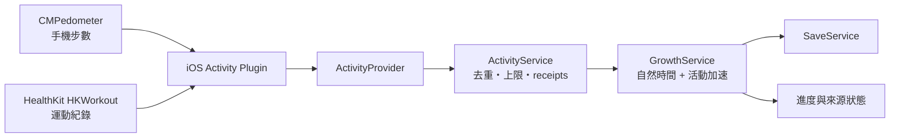

# 放置成長與活動加速規格

本文件是下一版養成規則的設計來源。核心原則是：**自然時間一定能完成孵化與進化；走路和運動只縮短等待，不是入場券。** 沒有 Apple Watch、無法行走、不願提供健康資料，或裝置暫時讀不到資料的玩家，都能取得相同怪獸、能力上限與收藏內容。

> 實作狀態：設計已確定，尚未寫入目前遊戲邏輯。現行 Stage A 仍是「500 模擬步或切換 24 小時孵化」，成長體也仍需三次訓練。實作新規則前，介面與驗收不得宣稱活動加速已完成。

## 玩家規則

每個成長階段都有一個自然時間。App 不必保持開啟；回到前景時，遊戲用 UTC 存檔時間補算經過時間。

| 階段 | 自然時間 | 不運動的結果 | 活動加速上限 |
| --- | ---: | --- | ---: |
| 蛋 → 幼年 | 24 小時 | 時間到後，下次結算即孵化 | 本階段最多縮短 25% |
| 幼年 → 成長 | 2 小時 | 時間到後，下次結算即成長 | 本階段最多縮短 25% |
| 成長 → 成熟 | 24 小時 | 時間到後，下次結算即成熟 | 本階段最多縮短 25% |

訓練不再是成熟的硬性門檻。力量、防禦與敏捷訓練仍決定成熟分支；完全沒有訓練或同分時，沿用公開的固定優先序 `power > guard > swift`。三種分支是玩法取向，不以活動資料解鎖，也不因運動量不同而形成更高能力上限。

保護性休眠不會停止年齡與成長時間。照顧會影響當下心情、健康和有限能力修正，但忙碌、臥床或長時間未開 App 不會永久失去怪獸。

## 活動點數

iOS 預計讀取兩種選配資料：

- 手機步數：Core Motion `CMPedometer`。
- 運動紀錄：Apple Health／HealthKit 的 `HKWorkout`。走路、輪椅、瑜伽、肌力、游泳等已寫入健康資料庫的運動，都以時間計算；不要求一定是步行，也不要求擁有 Apple Watch。

遊戲不讀取心率、路線、體重或醫療資料，不用卡路里判斷獎勵。不同身體條件與裝置對卡路里的估算差異很大，因此首版只使用步數與運動持續時間。

`HKWorkout` 可能由使用者手動建立，也可能來自不同的第三方 App；它不是運動強度或競賽誠信的證明。活動資料只縮短本機等待時間，並受每日與階段上限約束，不納入戰鬥能力、排行或日後伺服器信任判定。

### 換算預設

活動以 15 分鐘 UTC bucket 結算：

```text
step_points    = floor(bucket_steps / 100)
workout_points = floor(unique_workout_seconds_in_bucket / 60)
bucket_points  = max(step_points, workout_points)
daily_points   = min(sum(bucket_points), 60)
bonus_seconds  = accepted_points * 180
```

也就是每 100 步或每 1 分鐘運動為 1 點，每點增加 3 分鐘成長進度；每日最多接受 60 點，相當於最多 3 小時加速。每個階段另外受 25% 上限約束，所以任何階段至少仍需經過 75% 的自然時間。

這些數值必須放在 `data/balance.json`，不能寫死在 UI 或原生外掛。首輪實機測試後可以調整，但必須維持「不提供資料也能完整遊玩」和「活動不影響能力上限」。

### 不重複計算

同一次散步可能同時產生步數與 HealthKit workout。每個 15 分鐘 bucket 只取 `step_points` 與 `workout_points` 的較大值，不相加。重疊的多筆 workout 先取時間聯集，再算分鐘數；同一分鐘不因兩個 App 或兩種運動紀錄而重複。

活動點數按事件時間依序套用到當時的成長階段。該階段達標後，尚未使用的點數不帶到下一個階段、下一顆蛋或隔天。這避免囤積大量歷史資料後瞬間完成多輪養成。

每日上限依存檔的玩家時區切日。玩家改時區時，已結算 bucket 不重算；UTC bucket ID 和 high-water receipt 保證同一段資料最多入帳一次。

## 放置結算模型

目標實作新增 `GrowthService` 和 `ActivityService`，將目前互斥的「步數模式／時間模式」改成同一條進度：

```text
有效成長進度 = 自然經過秒數 + 已接受的活動加速秒數
完成條件       = 有效成長進度 >= 階段自然時間
```

`GrowthService` 依 UTC 時間順序處理：自然時間區段、活動 bucket、階段完成事件。若一次回到前景跨過多個邊界，完成時間和活動 receipt 必須是 deterministic；重新開啟或重查相同資料不能改變結果。

建議存檔欄位：

```text
growth: {
  phase: egg | baby | growing | mature,
  phase_started_at: int,
  required_seconds: int,
  settled_to: int,
  passive_seconds: int,
  activity_bonus_seconds: int,
  activity_bonus_cap_seconds: int,
  completed_at: int
}

activity_ledger: {
  version: int,
  timezone_offset_minutes: int,
  last_query_to: int,
  buckets: {
    bucket_id: {
      from_utc: int,
      to_utc: int,
      observed_steps: int,
      workout_seconds: int,
      accepted_points: int,
      applied_bonus_seconds: int,
      source_receipts: Array[String], # 雜湊後的來源 ID
      last_seen_at: int
    }
  }
}
```

歷史資料晚到時，以 bucket high-water 差額補算。來源之後刪除或下修資料時，不倒扣已使用的加速，也不允許之後再次入帳。查詢區間缺漏只標為 partial；自然時間照常結算。

## iOS 資料流程

GDScript 不直接呼叫 Core Motion 或 HealthKit。iOS 原生外掛以 Swift／Objective-C++ 查詢資料，再把純資料結果送回 Godot 主執行緒：



第一版只在初次連結、玩家手動同步，以及 App 回到前景時查詢近期資料，不要求遊戲常駐背景。`CMPedometer` 的歷史資料只保證最近七天，因此原生 provider 的重查視窗最多七天；超出可查範圍只失去選配加速，自然時間不受影響。[Apple CMPedometer](https://developer.apple.com/documentation/coremotion/cmpedometer)、[歷史查詢範圍](https://developer.apple.com/documentation/coremotion/cmpedometer/querypedometerdata(from:to:withhandler:))

HealthKit 使用 `HKSampleQuery` 或相應 descriptor 查詢 `HKWorkout`。只處理目前 iPhone 健康資料庫中、玩家允許讀取且查詢實際回傳的樣本；不能保證 Apple Watch 或第三方 App 的每筆資料一定已同步。[Apple Reading data from HealthKit](https://developer.apple.com/documentation/healthkit/reading-data-from-healthkit)、[HKSampleQuery](https://developer.apple.com/documentation/healthkit/hksamplequery)

## 權限、隱私與文案

活動資料是 opt-in。玩家第一次打開活動加速頁時才分別要求 Motion 與 Health 權限：

- Core Motion 需要 `NSMotionUsageDescription`，並可使用 `CMPedometer.authorizationStatus()` 顯示 motion 狀態。
- HealthKit 需要先以 `HKHealthStore.isHealthDataAvailable()` 檢查裝置能力，再配置 Xcode HealthKit capability、read authorization 與 `NSHealthShareUsageDescription`。此遊戲只要求讀取 workout type，不要求其他健康類型，也不寫入 HealthKit。
- HealthKit 基於隱私不會告訴 App 使用者是否拒絕某類資料的讀取；查不到資料可能是沒有紀錄、限制日期範圍或未授權。UI 必須寫「未取得可用的運動紀錄」，不可斷言「你拒絕了權限」，也不可把未知顯示成 0。[Apple authorization privacy](https://developer.apple.com/documentation/healthkit/authorizing-access-to-health-data)、[NSHealthShareUsageDescription](https://developer.apple.com/documentation/bundleresources/information-property-list/nshealthshareusagedescription)

原生回呼必須切回 Godot 主執行緒，並帶 query ID。畫面已離開、存檔已換蛋或 query ID 過期時丟棄回呼，避免舊資料覆蓋新狀態。

建議權限說明：

> 允許讀取步數與運動時間，可讓怪獸更快成長。即使不允許，也會隨時間正常孵化與進化。我們不讀取心率、路線或醫療資料。

活動 ledger 只保存去重所需的雜湊 receipt、時間 bucket、正規化步數／運動秒數、點數與 coverage，不保存 workout 名稱、心率、路線、卡路里或完整 HealthKit sample。這些檔案與含有活動加速結果的存檔必須在 iOS 標記為不進入 iCloud／裝置備份，且不得送到分析、廣告或遊戲伺服器。送審前還要在 App 內與 App Store Connect 提供可存取的隱私政策，說明讀取類型、用途、保留方式、撤回權限與刪除方式。Apple 的規則禁止把 HealthKit、Motion 與 Fitness 資料用於廣告、行銷或使用者資料探勘，也禁止把個人健康資訊存入 iCloud：[App Review Guidelines 5.1.1–5.1.3](https://developer.apple.com/app-store/review/guidelines/#privacy)。

HealthKit 必須用在清楚可見的健康／健身體驗，並在 App 描述與 Review Notes 說明 workout 如何提供活動加速；這項規格不能保證 Apple 審核結果。[App Review Guidelines 2.5.1](https://developer.apple.com/app-store/review/guidelines/#software-requirements)

## UI 要求

成長頁固定顯示：

- 預估自然完成時間，例如「即使不連結活動，也會在約 18 小時後孵化」。
- 本階段自然進度、活動加速時間，以及本日上限使用量。
- 資料狀態：未連結、同步中、已取得資料、部分涵蓋、未取得可用資料、裝置不支援、同步錯誤。
- 「連結活動資料」和「稍後再說」具有同等視覺層級；拒絕後不反覆彈窗。

不能出現「今天沒走所以不能孵化」、「未運動所以無法進化」或把健康資料授權包裝成必要條件的文案。

## 驗收條件

- 完全不授權 Motion／Health，關閉 App 後仍能依 24h／2h／24h 完成全部成長。
- 只有非步行 `HKWorkout` 時能取得活動點數；不要求步數或 Apple Watch。
- 同時存在步數與重疊 workout 時，每個 bucket 只取較大值。
- 重複同步、App 重開、延遲樣本、跨日、時區變更不會重複加速。
- 每日 60 點與每階段 25% 上限都可觀測；超額不帶到下一階段。
- 無資料、HealthKit 讀取不可見、Core Motion 拒絕、裝置不支援、查詢錯誤時，均不影響自然成長。
- 活動量不改變攻防敏上限、成熟物種可用性、戰鬥獎勵或收藏完整度。
- 去重 receipt 與活動結果只留在已排除 iCloud／裝置備份的本機資料，不送往遊戲伺服器、分析或廣告服務。
- 在 iPhone 17 Pro 與 iPhone 12 實機驗證前，只能標示「設計完成／原生未驗證」。

## 從目前版本遷移

現有存檔 schema 以 `egg.mode` 表示 `steps` 或 `time`。升級時：

1. 保留蛋 ID、`started_at`、已入帳步數 receipt 與寵物資料。
2. 所有未孵化蛋改用自然 24 小時，不要求玩家手動切換時間模式。
3. 舊 `credited_steps` 只轉成一次、受新階段上限限制的 activity bonus；轉換後寫 migration receipt，不能再次轉換。
4. 已孵化或已成熟個體不回退、不重跑進化。
5. `schema_version` 提升並保留舊版 backup；遷移失敗時載入原存檔，不留下半轉換狀態。

實作時需同步更新 `HatchService`、`EvolutionService`、provider contract、save schema、UI 與測試。本文件先確立目標規則，不把目前 Stage A 測試結果冒充為新規則驗證。
