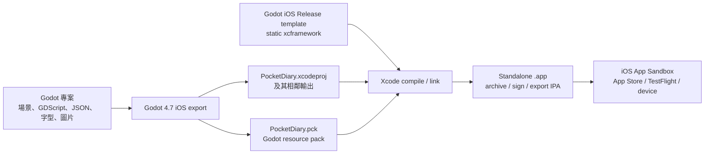
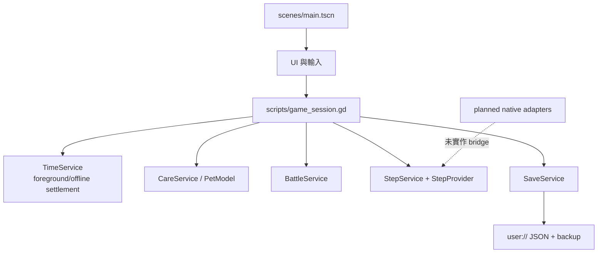
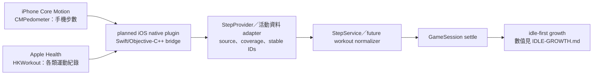
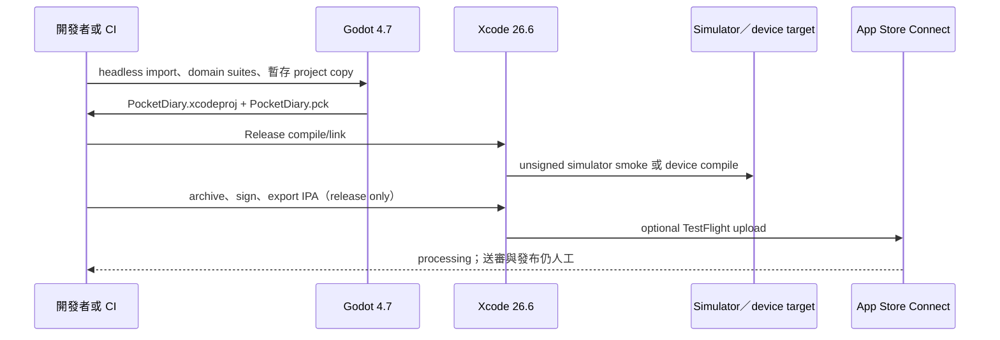

# Pixel Monster iOS 技術架構

> 本文件是依目前 repo 實作與本機驗證整理的技術說明。`CMPedometer` 與 HealthKit `HKWorkout` 仍是規劃中的原生介面；它們尚未是可宣稱已完成的功能。遊戲數值與放置結算規則以 [`IDLE-GROWTH.md`](IDLE-GROWTH.md) 為準，本文件不另行凍結數值。

## 先說結論

這不是「把 Godot 裝到玩家 iPhone 上」的產品。交付的是一個獨立、簽署過的 iOS App：Godot 負責遊戲內容、資源包和 iOS Xcode 專案，Xcode 負責編譯與連結原生引擎、封裝、簽署及輸出 IPA，Apple 的服務負責 App Store Connect 的處理與發佈流程。

玩家不需要安裝 Godot 或 Xogot，App 也不使用 WebView。Xogot 不是目前的 runtime 或 CI 依賴，只能作為日後選配的開發／試玩工具；本專案不假設它與桌面 Godot 4.7、原生外掛或本流程相容。平台範圍與 Xogot 邊界另見 [`MOBILE.md`](MOBILE.md)。

## 從專案到 App

Godot 官方的 iOS export 會產生 Xcode 專案；開啟該 `.xcodeproj` 後，Xcode 可以像處理其他 iOS App 一樣建置、部署和準備 App Store 版本：[Godot 4.7 Exporting for iOS](https://docs.godotengine.org/en/4.7/tutorials/export/exporting_for_ios.html)。Godot 的 iOS template 提供 `libgodot.ios.release.xcframework` 等靜態函式庫，Xcode 將它們連同匯出的專案與 PCK 編進 App；這不是讓玩家自行安裝 Godot：[Godot 4.7 Compiling for iOS](https://docs.godotengine.org/en/4.7/engine_details/development/compiling/compiling_for_ios.html)。

Godot 的 PCK 是資源包，通常包含 scripts、scenes、shaders、textures 和其他遊戲資源：[Godot 4.7 PCK](https://docs.godotengine.org/en/4.7/tutorials/export/exporting_pcks.html)。本專案的 [`project.godot`](../project.godot) 使用 Godot 4.7、Compatibility renderer、480×900 直式 viewport、`canvas_items` stretch；[`export_presets.cfg`](../export_presets.cfg) 設定 iOS 16.0 minimum、arm64、iPhone device family，並把 `data/*.json` 和 `assets/fonts/OFL.txt` 放入輸出，排除 tests、tools、docs 等開發檔案。

目前 preset 同時保留一個 `export_path` 名稱，但 `export_project_only=true` 的實際輸出是隔離目錄中的 `xcode/PocketDiary.xcodeproj`、相鄰的 `PocketDiary.pck` 和其他 Xcode 檔案；工具不把它當成 Godot 產出的 zip 再解壓。這個實際目錄輸出是 [`tools/ios/build_ios.py`](../tools/ios/build_ios.py) 和 CI smoke test 所使用的來源。

## 三方責任

| 工作 | Godot／本專案 | Xcode | Apple 裝置與服務 |
| --- | --- | --- | --- |
| 遊戲邏輯與畫面 | scenes、GDScript、domain services、JSON、assets，匯成 PCK | 不負責改寫遊戲規則 | 執行已連結的 App |
| iOS 專案輸出 | 依 export preset 產生 `.xcodeproj`、PCK 和 template 引用 | 讀取專案與 build settings | 提供 iOS SDK、Simulator runtime、裝置 runtime |
| 原生引擎 | 提供 Godot release static `.xcframework` template | compile、link Godot engine 與 App target | 在 App sandbox 中載入已簽署的二進位檔 |
| 未簽署 smoke | 產出 project-only Xcode 專案與 Release 資源 | Release simulator／device compile；simulator 可關閉 code signing | Simulator 執行 App；不能當成實機安裝證明 |
| 正式交付 | 暫存注入真實 Team、Bundle、版本和 signing inputs | archive、sign、`exportArchive` 產生 IPA | App Store Connect processing、TestFlight、送審與發布 |
| 步數／運動資料 | 目前只有 `StepProvider` 介面、`StepService` 和 debug Mock | 未來編譯原生 plugin／bridge | 未來由 Core Motion／HealthKit 提供資料與隱私授權 |

因此「打包是不是全部由 Godot 做」的答案是：內容和 Godot resource pack 是，最後的 iOS App packaging 不是。Xcode 與 Apple signing／distribution 是不可省略的後半段。

## App 內部的目前結構

啟動時 `GameSession` 載入 `user://` 存檔或建立初始狀態，再做時間結算；遊戲中的照顧、戰鬥、孵化和步數同步都走 domain service，最後由 `SaveService` 以暫存檔、flush、備份與替換保存。這些都是 GDScript／資源，不依賴雲端帳號或後端服務。

### 前景、暫停與離線結算

目前流程是：

1. App 在前景時，計時器和使用者操作讓 `GameSession` settle 並 commit。
2. 收到 pause 或 close 通知時先保存；回到前景時重新 settle，再同步可用的步數來源。
3. 若 App 被暫停或終止，下一次前景啟動依存檔時間戳做離線結算，並受現有的保護上限約束。

這不是靠「App 在背景持續跑遊戲迴圈」。Apple 的生命週期文件要求 App 進入背景後盡量少做工作，並在背景前完成重要保存：[Managing your app’s life cycle](https://developer.apple.com/documentation/uikit/managing-your-app-s-life-cycle)。目前沒有把背景遊戲迴圈、背景 workout session 或雲端回補當作正確性的前提；未來原生資料 adapter 也必須能在下次前景時查詢歷史資料並以穩定 ID 去重。

### Debug 與 Release 的界線

| 模式 | 目前行為 | 可以宣稱的用途 |
| --- | --- | --- |
| Godot debug | 使用 `MockStepProvider`、debug 存檔和測試控制，方便測完整流程 | 開發與 headless／UI 測試 |
| `--release-simulation` | 使用正式模式資料路徑，不提供假步數或快轉；原生來源尚未接上時保持 unavailable／unknown | 驗證正式行為與匯出 PCK，不是假裝有手機感測器 |
| iOS unsigned Release | Xcode `Release` 編譯；Simulator 使用明確的 syntax-only Team／Bundle placeholder，沒有 Apple signing | 驗證 production compile、PCK 和 Simulator 啟動 |
| signed device Release | 必須由 pipeline 暫時注入真實 Apple Team、Bundle、certificate、profile | 產出可分發的 IPA；需要真實 Apple inputs |

## iOS 檔案與 sandbox

Godot 專案中的 `res://` 資源會進入 PCK／App bundle，執行時視為應用程式資源，不應當作可寫入位置。存檔使用 `user://`；本專案設定 `config/use_custom_user_dir=true` 和 `PocketMonsterDiary` 名稱，讓 Godot 將使用者資料放在 App 的私有容器中。

iOS sandbox 由作業系統建立 App container；App 可在自己的 container 內讀寫，但不能任意讀寫使用者 home 或其他 App 的資料。Apple 的檔案總覽也明確說 iOS App 的檔案放在自己的 container，bundle 則是隨 App 提供的程式與資源：[Files and directories](https://developer.apple.com/documentation/technologyoverviews/files-and-directories)、[Apple App Sandbox](https://developer.apple.com/documentation/security/protecting-user-data-with-app-sandbox)。所以：

- 遊戲的 PCK、字型授權與內建 JSON 是 bundle 資源，按唯讀資源處理。
- 存檔、備份和之後的本機狀態寫入 `user://`，不是寫回 `res://`。
- 目前沒有登入、雲端存檔、遠端 API key 或必須連線才能結算的設計。

## 活動資料的原生邊界（規劃中）

目前 repo 沒有 `res://ios/plugins`、Swift／Objective-C++ bridge、HealthKit entitlement、`NSHealthShareUsageDescription` 或 `NSMotionUsageDescription`。`StepService` 現在處理的是 `StepProvider` 回傳的 source/status/coverage/buckets；正式模式若沒有原生來源，會保留無法取得狀態，不捏造 0 步。以下是未來的資料邊界，不是本版已完成的功能：

### Core Motion：手機步數

規劃中的 `CMPedometer` adapter 讀 iPhone 的系統步數，可查詢歷史區間，也可以接收之後的 live updates；Apple 要求在 Info.plist 提供 `NSMotionUsageDescription`：[CMPedometer](https://developer.apple.com/documentation/coremotion/cmpedometer)。這是手機步數來源，不把 Apple Watch 當成必要硬體，也不會在尚未有 bridge 時由 GDScript 直接呼叫 Core Motion。

### HealthKit：只讀 `HKWorkout`

活動來源也包含 Apple Health 的 workout records，而不只 walking。規劃中的 read-only adapter 會查詢 `HKWorkout`：每筆紀錄有 activity type，並可帶有 duration、distance、energy 等摘要，因此可以涵蓋跑步、騎車、重量訓練等非步行運動；不會在本文件先規定它們如何換算成遊戲數值：[HKWorkout](https://developer.apple.com/documentation/healthkit/hkworkout)。

這個方向不要求 Apple Watch。只要 iPhone 的 Health store 實際有可讀的 workout records 就能成為候選資料；沒有紀錄時就沒有可供遊戲採用的活動資料，不能用推測值補上。

原生 adapter 的必要工程項目會包括：

- Xcode HealthKit capability／entitlement，以及讀取用途說明 `NSHealthShareUsageDescription`；這是 read-only 讀取所需的隱私設定。未來若永遠不寫入 HealthKit，不把 `NSHealthUpdateUsageDescription` 假裝成已完成需求。[Setting up HealthKit](https://developer.apple.com/documentation/healthkit/setting-up-healthkit)
- 呼叫 `HKHealthStore` 的 read authorization 流程，再把結果轉成 Godot 可消費的 stable ID、時間區間、來源和 coverage。
- 讓 GDScript 只看穩定的 provider／adapter 介面，不直接 import Swift、Objective-C++ 或 Apple framework。Godot 的 iOS plugin 機制使用 `.gdip` 加上 `.a` 或 `.xcframework`；但官方 4.7 頁面明確標示內容尚未更新到 4.7，因此真正實作前仍需依固定版本驗證：[Creating iOS plugins](https://docs.godotengine.org/en/4.7/tutorials/platform/ios/ios_plugin.html)

HealthKit 的空結果不能直接解讀成「使用者拒絕了權限」。Apple 說明 App 不知道使用者是否准許或拒絕特定讀取權限；拒絕時查詢可能只回傳 App 自己寫入的 samples，且使用者也可能只授權最近一段時間。`authorizationStatus(for:)` 反映的是指定資料型別的分享／寫入授權，不是讀取權限的可靠診斷：[Authorizing access to health data](https://developer.apple.com/documentation/healthkit/authorizing-access-to-health-data)、[HKAuthorizationStatus](https://developer.apple.com/documentation/healthkit/hkauthorizationstatus)。因此未來 adapter 遇到空結果要表達「沒有目前可讀資料／涵蓋有限／資料不可用」等狀態，不得捏造「一定是拒絕」。`requestAuthorization` completion 的成功也只代表授權請求處理完成，不代表每一種讀取權限都已獲准：[requestAuthorization](https://developer.apple.com/documentation/healthkit/hkhealthstore/requestauthorization%28toshare%3Aread%3Acompletion%3A%29)。

活動資料如何影響自然成長、加速上限，以及非步行 workout 的換算方式，定義在 [`IDLE-GROWTH.md`](IDLE-GROWTH.md)；本文件只定義原生資料要經過 bridge 和 provider 邊界，且不可把空資料當成活動量。

### 本機資料與 App Store 隱私邊界

原生層只回傳去重所需的雜湊 receipt、時間區間、coverage、步數與 workout 持續時間；點數和加速上限由 GDScript domain 計算。原生層不把 workout 名稱、心率、路線、卡路里或完整 HealthKit sample 寫入 Godot 存檔。活動 ledger 與含活動加速結果的 save 必須透過 iOS 原生層設定 `NSURLIsExcludedFromBackupKey`，並在實機驗證不會進入 iCloud／裝置備份。資料不傳到分析、廣告或遊戲伺服器。

上架前必須在 App 內與 App Store Connect 提供隱私政策，明確說明讀取 workout 與步數的用途、保留／刪除方式及如何撤回授權；App Store privacy answers 和 Review Notes 也要與實際 binary 一致。Apple 禁止將 HealthKit、Motion 與 Fitness 資料用於廣告、行銷或使用者資料探勘，並禁止將個人健康資訊存入 iCloud：[App Review Guidelines 5.1.1–5.1.3](https://developer.apple.com/app-store/review/guidelines/#privacy)。HealthKit 功能也必須呈現清楚的健康／健身用途：[App Review Guidelines 2.5.1](https://developer.apple.com/app-store/review/guidelines/#software-requirements)。

## Release、Simulator 與裝置模板

### 本機／CI 的實際流程

詳細命令、secrets、profile/keychain 清理和手動 TestFlight 流程集中在 [`IOS-CICD.md`](IOS-CICD.md)；這裡只保留架構上的順序。CI workflow 是 [`../../../.github/workflows/pixel-monster-ios.yml`](../../../.github/workflows/pixel-monster-ios.yml)，其 unsigned path 會先跑 headless suites，再用新鮮的 project copy 匯出直接的 Xcode 目錄，最後用該目錄的 `PocketDiary.pck` 跑 `test_flow.gd --release-simulation --expect-packed`，避免 smoke 測到 repo 外的 fallback 資源。

### Debug、Release 與 signing

- 專案和 template 固定 Godot `4.7.stable`（目前 workflow pin 到 official commit `5b4e0cb0fd279832bbdd69fed5354d4e5ad26f88`）；Xcode job 固定 26.6／build 17F113。這是工程輸入，不代表 GitHub cloud runner 已經由本文件再次執行。
- iOS Simulator 只使用 Compatibility renderer；這也符合 Godot 官方 iOS 文件的限制。[Exporting for iOS](https://docs.godotengine.org/en/4.7/tutorials/export/exporting_for_ios.html)
- unsigned simulator 明確使用測試用 syntax placeholder，並以 `CODE_SIGNING_ALLOWED=NO` 的 Xcode Release compile 驗證 production code path；placeholder 絕不進 signed release。
- signed release 需要真實 Team ID、唯一 Bundle ID、certificate 和 provisioning profile。它們由 protected `ios-release` environment 注入，不提交到 repo；Apple 官方也指出 Team ID 和 Bundle Identifier 是 iOS export 的必要欄位。
- 成功的 release Xcode 流程是 compile/link → archive → sign → export IPA；可選的 altool 階段只把已簽 IPA 上傳到 TestFlight，不自動送審或發布。完整邊界見 [`IOS-CICD.md`](IOS-CICD.md)。

### arm64 Simulator workaround

目前官方 Godot 4.7 `ios.zip` 在本機檢查到 simulator library 只有 Intel `x86_64` slice，而 Apple Silicon simulator smoke 需要 arm64。unsigned path 因此由 [`prepare_simulator_template.py`](../tools/ios/prepare_simulator_template.py) 以相同 Godot source、Release target、`ios_simulator=yes` 和固定 SCons 版本補建 arm64 simulator library，再與官方 simulator library 合併；官方 device library 保留原樣。

這個 `IOS_SIMULATOR_TEMPLATE` 只在暫存的 unsigned simulator preset 使用。signed device release 不接受這個 override，仍使用官方 device template。此 workaround 是目前 CI 的 build-input 修補，不是宣稱所有 Godot 版本或所有 Apple Silicon runner 都有相同問題；實際支援仍以固定版本的 template／source 檢查為準。

## 驗證證據與未完成事項

目前本機紀錄 [`VALIDATION.md`](VALIDATION.md) 顯示：

| 已有證據 | 限定解讀 |
| --- | --- |
| Godot 4.7 headless suites 通過；正式匯出 PCK 資源 smoke 17 checks、0 failures | 證明目前 GDScript、資源篩選、`balance.json`、`opponents.json` 和 OFL 字型授權在這條流程可被載入 |
| iPhone 17 Pro 與 iPhone 12 的 iOS 26.5 arm64 Simulator Release build／啟動 smoke 通過 | 是 Simulator 證據，不是實體手機證據；也不等於 iOS 16 runtime 已測 |
| 官方 device template 的 unsigned arm64 Release compile 通過 | 證明 device target 可編譯；未簽 App 不能直接當作可安裝產品 |
| offline pipeline tests、模板 helper tests、startup checks 通過 | 證明本機腳本契約和錯誤檢查；不等於 GitHub Actions cloud run 已通過 |

以下目前不能宣稱完成：

- iPhone 17 Pro 或 iPhone 12 實機安裝、觸控、安全區、效能與耗電驗證。
- iOS 16 實際 runtime 驗證。
- Apple Distribution signing、TestFlight processing、App Review 或正式發布。
- `CMPedometer` plugin、HealthKit `HKWorkout` read-only adapter、entitlement、Info.plist privacy strings 及原生 callback lifecycle。
- 任何 Apple Watch 必要性結論；本設計是不依賴 Apple Watch，但仍要求 Health store 真有可讀 records。
- Xogot 對本專案 exact Godot version 或上述原生 plugin 的相容性。

因此目前可交付的是「Godot 內容 + 原生 Godot engine + Xcode 建置鏈」的 iOS 技術基礎；原生活動資料和實機發行仍是清楚標示的後續工作，而不是已由 Simulator 或桌面測試代替完成。
