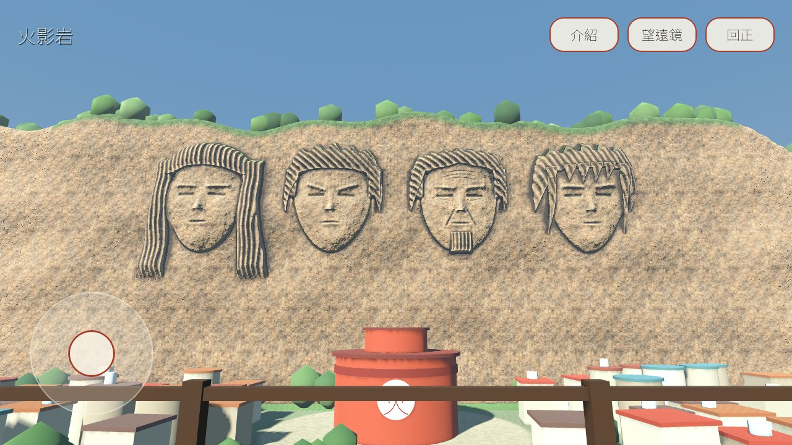

# 聖地展望台（seichi-pov）

用手機以第一人稱站上展望台，看動畫經典場景。第一個景點是《火影忍者》的火影岩：木葉村中央有一座 25 m 高的木造展望台，離岩壁約 170 m。玩家在平台上可以小範圍前後左右走動、環顧四周，也能拉近細看。



**狀態：** 進行中。v0 能跑，但美術不合格，岩壁與村莊將改用 AI 生成高模再減面烘焙。決策與規格見 [PROJECT.md](PROJECT.md)，待辦見 [TODO.md](TODO.md)。私人同人原型，不公開發佈。

## 要驗證的假設

1. 用「粗模型加貼圖」的程序管線（不用手工建模或付費 AI 生成），手機上也能做出認得出來的動畫地標。
2. 「固定平台、可走範圍與視角錐都有限」這種玩法夠讓人看景，而且因為鏡頭到不了的地方不用做，場景成本可控。
3. 景點能做成資料加上 scene 的組合，下一個景點不必重寫觀看器。

## 建模路線

v0 的岩壁是「粗模型加貼圖」：Python 把高度場轉成低解析網格，細節烘進法線貼圖；沒有用 voxel，因為 170 m 外的階梯感只剩雜訊，面數卻會失控。這個「高度場／網格加貼圖」的接口會保留。臉的來源已改為 AI 生成高模，再由我們減面和烘焙，見 PROJECT 的裁定 D1–D10。

## 三個參考專案各借了什麼

| 來源 | 借用的做法 | 在本專案的位置 |
|---|---|---|
| AOT 沙盤 | 靜態裝置分級（解析度倍率、MSAA、陰影）；固定 seed 的程序城鎮，道路與保留區會避讓；同材質合批；產生器會回讀驗證 | `viewer/quality.gd`、`tools/build_scenery.gd` |
| voxel-musou | 烘焙 AO、空氣透視霧、地形與佈置共用同一份空間資料（道路不會長出房子） | `tools/bake_relief.py`、`layout.json` 同時餵給地面貼圖與房屋擺放 |
| china-heritage-3d | 每個景點一份資料（名稱、副題、介紹、出處）；素宣紙、墨色、朱印的介紹卡；固定的初始機位 | `spots/spot.gd` 的 export 欄位、`ui/hud.tscn` |

## 執行

```sh
# 編輯器
/Applications/Godot.app/Contents/MacOS/Godot -e --path prototypes/seichi-pov
# 直接玩（桌機：WASD 走、左鍵拖曳環顧、滾輪縮放）
/Applications/Godot.app/Contents/MacOS/Godot --path prototypes/seichi-pov
```

手機操作：左下搖桿走動，單指拖曳環顧，雙指捏合縮放。頂列的「望遠鏡」一鍵拉近，「回正」回到起點，「介紹」打開說明卡。

## 驗證

```sh
G=/Applications/Godot.app/Contents/MacOS/Godot
# 互動測試：真實觸控事件、搖桿、拖曳、捏合、滾輪、按鈕、平台與視角限制（21 項）
$G --headless --path prototypes/seichi-pov --script res://tests/test_viewer.gd
# 截圖與效能預算（要開視窗；超出預算 exit 1）
$G --path prototypes/seichi-pov --script res://tests/capture.gd -- --quality=high
$G --path prototypes/seichi-pov --script res://tests/capture.gd -- --quality=low
```

Godot 遇到 SCRIPT ERROR 仍可能 exit 0，判讀時也要 grep `SCRIPT ERROR|Parse Error`。

2026-10-01，M1 Pro 實測（含陰影 pass）：

| 檔位 | 最多三角形 | 最多 draw call | 預算 |
|---|---:|---:|---|
| high（陰影 500 m、MSAA 4×） | 207k | 88 | 250k／100（暫定，未上實機） |
| low（無陰影、0.7 倍解析度） | 129k | 42 | 250k／100 |

截圖在 `docs/evidence/`：中央、望遠鏡、平台四角、左右轉到底、仰角與俯角到底，每張都有 high 和 low 兩版。目前還沒在實機上量過 FPS。

## 結構

| 路徑 | 內容 | 在編輯器裡可調 |
|---|---|---|
| `main.tscn` | 景點與 HUD 的組合，套用品質檔位 | 換景點：替換 `Spot` 子場景 |
| `spots/hokage_rock/hokage_rock.tscn` | 火影岩景點：天空、太陽、霧、岩壁、地面、村落、火影大樓、展望台、Viewer | 太陽角度、霧濃度、大樓與平台的位置；`HokageRock` 根節點上的名稱、副題、介紹文字 |
| `viewer/viewer.tscn` | 第一人稱鏡頭 | `half_extents`（可走範圍）、`yaw_limit_deg`、俯仰角範圍、FOV 範圍、移動速度 |
| `ui/hud.tscn`、`ui/hud_theme.tres` | 搖桿、環顧觸控面、頂列按鈕、介紹卡 | 版面、配色、字級、按鈕文字（標題與介紹卡內容來自景點根節點的 export） |
| `spots/hokage_rock/baked/` | 烘焙產物：`cliff.obj`、浮雕與岩石貼圖、地面貼圖、`scenery.tscn`（MultiMesh 房屋與樹） | 是來源檔。執行和測試時不會重建 |
| `spots/hokage_rock/layout.json` | 道路、廣場、村落範圍 | 改完重跑兩個產生器 |
| `tools/` | 製作工具，見下節 | — |

## 重新產生資產

產生器只是製作工具。每次重跑都會覆蓋 `baked/` 裡的檔案，commit 前先看 diff。

```sh
cd prototypes/seichi-pov
python3 tools/bake_relief.py --preview   # 1 秒出浮雕預覽圖 art_src/relief_preview.png，調臉用
python3 tools/bake_relief.py             # 約 50 秒：cliff.obj + 浮雕／岩石貼圖 + cliff_top.json
python3 tools/bake_ground.py             # 地面貼圖（依 layout.json）
$G --headless --path . --import
$G --path . --script res://tools/build_scenery.gd   # 不可加 --headless，見下方地雷
# 只有第一次建場景才需要；已存在的檔案會跳過，加 -- --force 才覆蓋
$G --headless --path . --script res://tools/author_scenes.gd
```

臉的造型參數在 `bake_relief.py` 的 `FACES`、`STYLE` 和 `face_height()`：髮型、眉形、下顎、皺紋都是 SDF 和高斯函數組合出來的。

## 已知地雷

- **MultiMesh 不能在 headless 下產生。** dummy renderer 會丟掉 instance 資料，存出來的 `.res` 全是零矩陣，畫面上什麼都沒有，也不會報錯。`build_scenery.gd` 偵測到 headless 會直接拒絕執行，存檔後也會回讀比對。
- **測試送滾輪事件要成對。** 只送 press 不送 release，GUI 的滑鼠焦點會卡在 LookPad，之後所有按鈕都點不到。
- Compatibility renderer 用 Filmic 加 0.9 的環境光時，砂岩整片過曝。目前用 AgX、環境光 0.45。

## 發現（v0）

- 浮雕辨識度主要來自髮型剪影：柱間的長直髮、扉間的刺短髮、日斬的鬍子和皺紋、湊的瀏海與側髮。170 m 外看不到五官，用望遠鏡拉到 24° 才看得出表情。
- 岩壁幾何只有 64k 個三角形，細節全靠 4096×2048 的法線貼圖，望遠鏡拉近也沒有露出低模感。
- 效能大戶是陰影 pass 和樹。樹分成四區，視錐剔除會整區略過，也不投射陰影，三角形因此從 49 萬降到 21 萬。

## 下一步

見 [TODO.md](TODO.md)。
